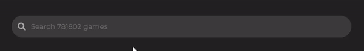
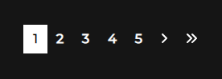

# 🎮 React Project - Video Game Searching Page
> 75만여가지의 게임을 검색해보세요!

RAWG gaming api를 사용하여 제작하였습니다.<br>
모든 게임을 검색하고 상세 정보를 확인할 수 있습니다.<br><br>
보러가기: <https://camac0808.github.io/React-project>


## 프로젝트에 사용된 언어 및 라이브러리

* React 
* Bootstrap
* AOS
* Font-Awesome

## 프로젝트의 기능 설명

### 1. api fetch loading시 간단한 이모티콘 애니메이션을 추가


### 2. header search 기능 및 hover transition 추가


### 3. hamburger button을 눌러서 sidebar 나오는 transition 구현


### 4. login button에 간단한 hover transition과 blur 넣어서 빛나는듯한 효과 구현


### 5. boot-strap을 이용하여 login-page 간단하게 구현 (로그인은 되지 않습니다)


### 6. 첫페이지 랜딩시 AOS 라이브러리를 사용하여 game-card 및 title에 fade 효과 구현


### 7. game-card에 마우스 hover시 상세페이지로 연결되는 link와 간단한 상세정보 하단에 나오도록 구현


### 8. 하단에 pagination 구현


## 배포
```sh
make install
npm test
```

## 업데이트 내역

* 0.2.1
    * 수정: 문서 업데이트 (모듈 코드 동일)
* 0.2.0
    * 수정: `setDefaultXYZ()` 메서드 제거
    * 추가: `init()` 메서드 추가
* 0.1.1
    * 버그 수정: `baz()` 메서드 호출 시 부팅되지 않는 현상 (@컨트리뷰터 감사합니다!)
* 0.1.0
    * 첫 출시
    * 수정: `foo()` 메서드 네이밍을 `bar()`로 수정
* 0.0.1
    * 작업 진행 중

## 정보

이름 – [@트위터 주소](https://twitter.com/dbader_org) – 이메일주소@example.com

XYZ 라이센스를 준수하며 ``LICENSE``에서 자세한 정보를 확인할 수 있습니다.

[https://github.com/yourname/github-link](https://github.com/dbader/)

## 기여 방법

1. (<https://github.com/yourname/yourproject/fork>)을 포크합니다.
2. (`git checkout -b feature/fooBar`) 명령어로 새 브랜치를 만드세요.
3. (`git commit -am 'Add some fooBar'`) 명령어로 커밋하세요.
4. (`git push origin feature/fooBar`) 명령어로 브랜치에 푸시하세요. 
5. 풀리퀘스트를 보내주세요.

<!-- Markdown link & img dfn's -->
[npm-image]: https://img.shields.io/npm/v/datadog-metrics.svg?style=flat-square
[npm-url]: https://npmjs.org/package/datadog-metrics
[npm-downloads]: https://img.shields.io/npm/dm/datadog-metrics.svg?style=flat-square
[travis-image]: https://img.shields.io/travis/dbader/node-datadog-metrics/master.svg?style=flat-square
[travis-url]: https://travis-ci.org/dbader/node-datadog-metrics
[wiki]: https://github.com/yourname/yourproject/wiki
